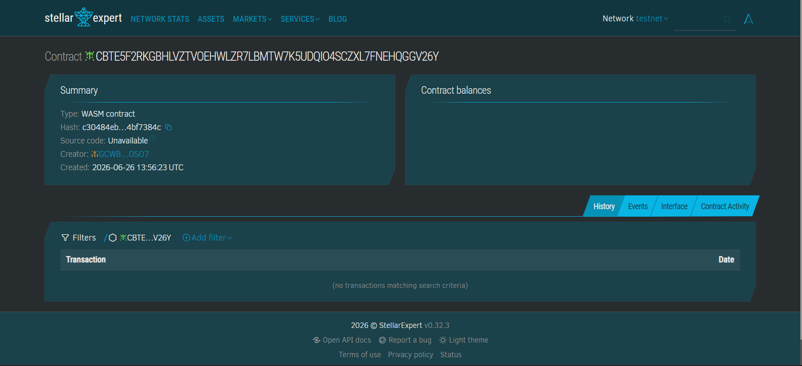

# Rental Deposit Escrow

A decentralized rental deposit escrow dApp built on **Stellar Soroban**. Tenants deposit rent securely into an escrow smart contract, and funds are only released to the landlord when both parties agree — or resolved by an admin if a dispute arises.

## Architecture

```
rental-deposit-escrow/
├── contracts/escrow/     # Soroban smart contract (Rust)
├── frontend/             # React + Vite + TypeScript + Tailwind
├── backend/              # Node.js + Express + TypeScript + Prisma + PostgreSQL
├── scripts/              # Deployment & utility scripts
└── assets/               # Screenshots & media
```

## Smart Contract (Rust, Soroban SDK 21.7.7)

### Entry Points

| Function | Description |
|---|---|
| `initialize` | Set contract admin (once) |
| `create_escrow` | Landlord creates an escrow agreement |
| `deposit` | Tenant deposits the rent amount |
| `request_release` | Landlord requests fund release |
| `approve_release` | Tenant approves release → funds sent to landlord |
| `raise_dispute` | Either party raises a dispute |
| `resolve_dispute` | Admin resolves dispute with custom split |
| `cancel` | Cancel escrow before deposit |
| `get_escrow` | View escrow details |
| `get_escrow_count` | Total escrows created |

### State Machine

```
Created ──→ WaitingDeposit ──→ Locked ──→ ReleaseRequested ──→ Completed
                                 │                                  ↑
                                 └──────→ Disputed ──→ Resolved ────┘
Created ──→ Completed (cancel)
```

- **Created**: Escrow created by landlord
- **WaitingDeposit**: Awaiting tenant deposit (reserved for future use)
- **Locked**: Tenant has deposited, funds held by contract
- **ReleaseRequested**: Landlord has requested release
- **Completed**: Funds released to landlord, or escrow cancelled
- **Disputed**: Either party raised a dispute
- **Resolved**: Admin resolved the dispute, funds split

### Errors

| Code | Error | Description |
|---|---|---|
| 1 | Unauthorized | Wrong caller for an action |
| 2 | EscrowNotFound | Escrow ID doesn't exist |
| 3 | InvalidState | Action not allowed in current state |
| 4 | DepositAlreadyMade | Double deposit attempt |
| 5 | NotTenant | Only tenant can deposit |
| 6 | NotLandlord | Only landlord can request release |
| 7 | AlreadyResolved | Dispute already resolved |
| 8 | InvalidAmount | Zero or negative deposit, or split mismatch |
| 9 | DepositNotMade | No deposit found |
| 10 | InvalidEndDate | End date must be in the future |
| 11 | AlreadyCancelled | Escrow already cancelled |
| 12 | CannotCancelAfterDeposit | Cannot cancel after deposit made |
| 13 | NotAdmin | Only admin can resolve disputes |

### Events

- `ESC_CREAT` — Escrow created
- `DEP_RECV` — Deposit received
- `REL_REQ` — Release requested
- `REL_APPR` — Release approved
- `DISP_RAIS` — Dispute raised
- `DISP_RES` — Dispute resolved
- `CANCELLED` — Escrow cancelled

## Deployment

### Testnet

| Detail | Value |
|---|---|
| **Network** | Stellar Testnet |
| **Contract ID** | `CBTE5F2RKGBHLVZTVOEHWLZR7LBMTW7K5UDQIO4SCZXL7FNEHQGGV26Y` |
| **Deployer** | `GCWBVEJQTGKPZUUDAV6UOP7GCFJMNSJIKYSAFX72RK22ZQXHJGDXOSO7` |
| **WASM Hash** | `c30484ebc8e6fa6a14330460d6be240b36b5466e10e6441760b0acea4bf7384c` |

**Explorer links:**
- Contract: https://stellar.expert/explorer/testnet/contract/CBTE5F2RKGBHLVZTVOEHWLZR7LBMTW7K5UDQIO4SCZXL7FNEHQGGV26Y
- Deploy TX: https://stellar.expert/explorer/testnet/tx/9625709092ad1d04f4f6f445428645782ce0626ea2b62883140614f63bde5099

### Screenshot



*To capture the screenshot:*
1. Open https://stellar.expert/explorer/testnet/contract/CBTE5F2RKGBHLVZTVOEHWLZR7LBMTW7K5UDQIO4SCZXL7FNEHQGGV26Y
2. Take a screenshot of the page
3. Save it to `assets/screenshot.png`

## Running Tests

```bash
cd contracts/escrow
cargo test
```

All 18 tests (10 success + 8 should_panic) should pass.

## Building WASM

```bash
cd contracts/escrow
cargo build --target wasm32-unknown-unknown --release
```

Output: `target/wasm32-unknown-unknown/release/escrow.wasm`

## Deploying with Stellar CLI

```bash
# Create identity (if needed)
stellar keys generate my-key --network testnet
stellar keys fund my-key --network testnet

# Deploy
stellar contract deploy \
  --wasm target/wasm32-unknown-unknown/release/escrow.wasm \
  --alias escrow \
  --network testnet \
  --source-account my-key

# Initialize
stellar contract invoke \
  --id <CONTRACT_ID> \
  --network testnet \
  --source-account my-key \
  -- \
  initialize \
  --admin <PUBLIC_KEY>

# Create escrow
stellar contract invoke \
  --id <CONTRACT_ID> \
  --network testnet \
  --source-account my-key \
  -- \
  create_escrow \
  --landlord <LANDLORD_ADDR> \
  --tenant <TENANT_ADDR> \
  --deposit_amount 500000000 \
  --token <TOKEN_ADDR> \
  --rental_end_date <FUTURE_TIMESTAMP>
```

## Tech Stack

- **Smart Contract**: Rust, Soroban SDK 21.7.7
- **Frontend**: React 19, Vite 6, TypeScript, TailwindCSS 4, Framer Motion, Stellar Wallet Kit
- **Backend**: Node.js, Express, TypeScript, Prisma, PostgreSQL, Zod, express-rate-limit
- **CLI**: Stellar CLI 25.2.0

## Recent Improvements

- **Rate limiting**: Auth endpoints are rate-limited (20 requests per 15 minutes) via `express-rate-limit`
- **PATCH status endpoint**: Missing `updateStatus` route added at `PATCH /api/escrows/:id/status`
- **Typed API client**: Replaced `any` payloads with specific TypeScript interfaces (`EscrowActionInput`, `ResolveDisputeInput`, etc.)
- **Stepper fixes**: EscrowStepper now handles `Disputed`, `Resolved`, and `WaitingDeposit` states gracefully
- **Cleaned up directives**: Removed stale `"use client"` directives from non-Next.js files

## License

MIT
